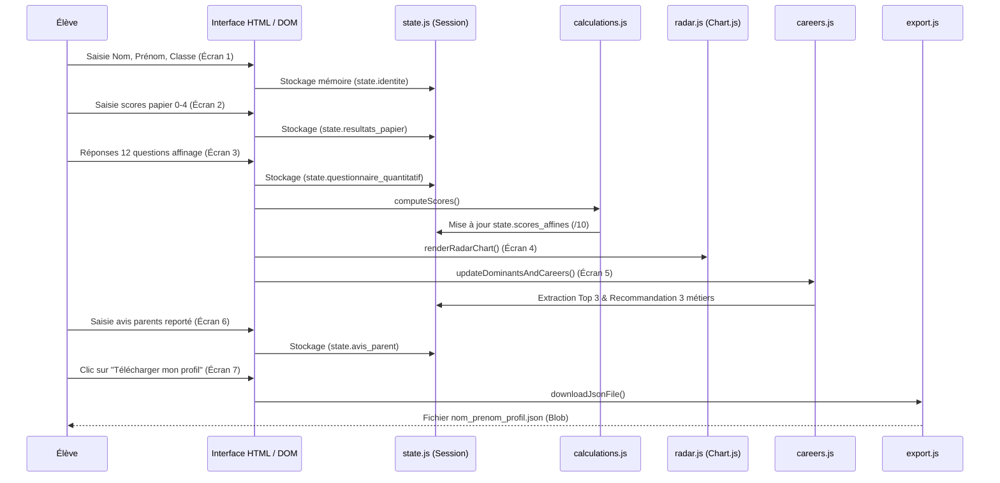

# Wiki — Architecture Système

> 📍 **Index principal** : [Retour à docs/INDEX.md](../INDEX.md)  
> 🔗 **Documents connexes** : [Contrat de données](./data-contract.md) | [Modules JS](./modules-js.md) | [Design System](./design-system.md)

---

## 1. Principes Fondamentaux

L'application **"Profil en 6 couleurs"** répond à trois contraintes architecturales fortes :

1. **Zero-Backend (Serverless pur)** :
   - L'application est un ensemble de fichiers statiques (HTML5, CSS3, ES6 Modules).
   - Déployable sur n'importe quel CDN ou hébergement statique comme **GitHub Pages**.
   - Aucune base de données distante, aucune API REST / GraphQL, aucun abonnement requis.

2. **Confidentialité & RGPD par conception** :
   - Aucune information personnelle (nom, prénom, classe, réponses aux questionnaires, avis familial) n'est envoyée sur le réseau.
   - Les données restent strictement en mémoire dans l'objet JavaScript [`state`](./modules-js.md#statejs) de la session du navigateur.
   - L'élève garde la maîtrise absolue de ses données via le téléchargement local du fichier JSON.

3. **Autonomie et Résilience Hors Ligne** :
   - La table de correspondance des métiers est embarquée avec un mécanisme de secours intégré dans [`js/careers.js`](./modules-js.md#careersjs) garantissant le fonctionnement même si l'élève ouvre directement `index.html` en local (`file://`).

---

## 2. Cycle de Vie de la Session Élève

---

## 3. Déploiement GitHub Pages

1. Branche principale : `main`
2. Dossier source : `/ (root)`
3. Pas d'étape de compilation ni de `npm run build` : les navigateurs modernes chargent nativement ``.
