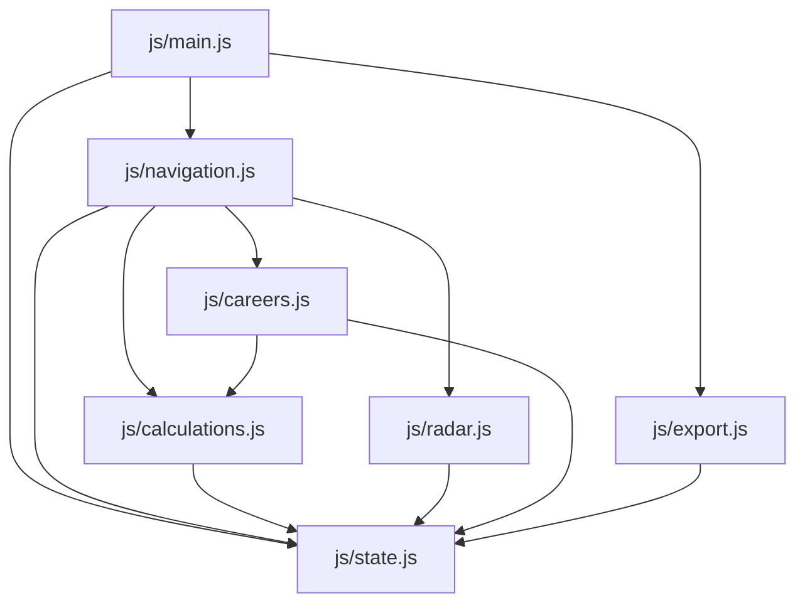

# Wiki — Modules JavaScript (`js/`)

> 📍 **Index principal** : [Retour à docs/INDEX.md](../INDEX.md)  
> 🔗 **Documents connexes** : [Architecture](./architecture.md) | [Contrat JSON](./data-contract.md)

L'application utilise les **ES Modules natifs** du standard ECMAScript. Aucun bundler (Webpack, Vite, Rollup) n'est nécessaire. Tous les modules font **moins de 120 lignes**.

---

## 1. Vue d'ensemble des modules

---

## 2. Fiches Techniques par Module

### `state.js` (~65 lignes)
- **Rôle** : Définition de l'objet réactif singleton `state`, des palettes de couleurs hexadécimales, des codes RIASEC et des 12 questions d'affinage.
- **Exports clés** :
  - `state` : Objet mémoire de session.
  - `POLE_COLORS` : Couleurs thématiques RIASEC.
  - `POLE_CODES` : Dictionnaire clé -> lettre (ex: `realiste: 'R'`).
  - `QUESTIONS_CONFIG` : Définition des 12 questions calibrées.

### `calculations.js` (~37 lignes)
- **Rôle** : Calculs statistiques RIASEC et tri des dominantes.
- **Exports clés** :
  - `computeScores()` : Normalise chaque pôle sur 10 selon `((papier + q1 + q2) / 14) * 10`.
  - `extractTopPoles()` : Trie les 6 scores et retourne le Top 3 des dominantes.

### `radar.js` (~98 lignes)
- **Rôle** : Création et mise à jour de l'instance **Chart.js** et des barres horizontales.
- **Exports clés** :
  - `renderRadarChart()` : Instancie le radar polaire à 6 axes avec échelle fixe de 0 à 10.
  - `renderScoreBars()` : Génère les barres de progression colorées sous le graphique.

### `careers.js` (~93 lignes)
- **Rôle** : Moteur de recommandation des métiers et gestion des votes d'appétence.
- **Exports clés** :
  - `updateDominantsAndCareers()` : Détermine le duo dominant (ex: `IS`), génère la phrase qualitative et propose 3 métiers.
  - Embarque une table de secours `FALLBACK_MAPPINGS` pour un fonctionnement 100% hors-ligne.

### `navigation.js` (~109 lignes)
- **Rôle** : Pilotage du stepper (Écrans 1 à 7) et validation des saisies.
- **Exports clés** :
  - `goToStep(stepNumber)` : Contrôle la validité de l'étape courante, bascule l'affichage et actualise la barre de progression.

### `export.js` (~63 lignes)
- **Rôle** : Création du payload conforme au [contrat JSON](./data-contract.md) et déclenchement du téléchargement local.
- **Exports clés** :
  - `buildExportPayload()` : Produit l'objet JSON sérialisable exact.
  - `downloadJsonFile()` : Crée l'objet `Blob` et déclenche le téléchargement du fichier `<nom>_<prenom>_profil.json`.

### `main.js` (~110 lignes)
- **Rôle** : Point d'entrée de l'application (chargé par `index.html`), instancie le DOM dynamique et attache les écouteurs d'événements.
